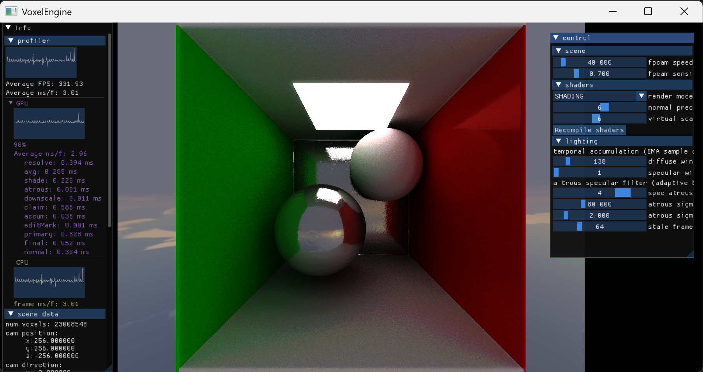
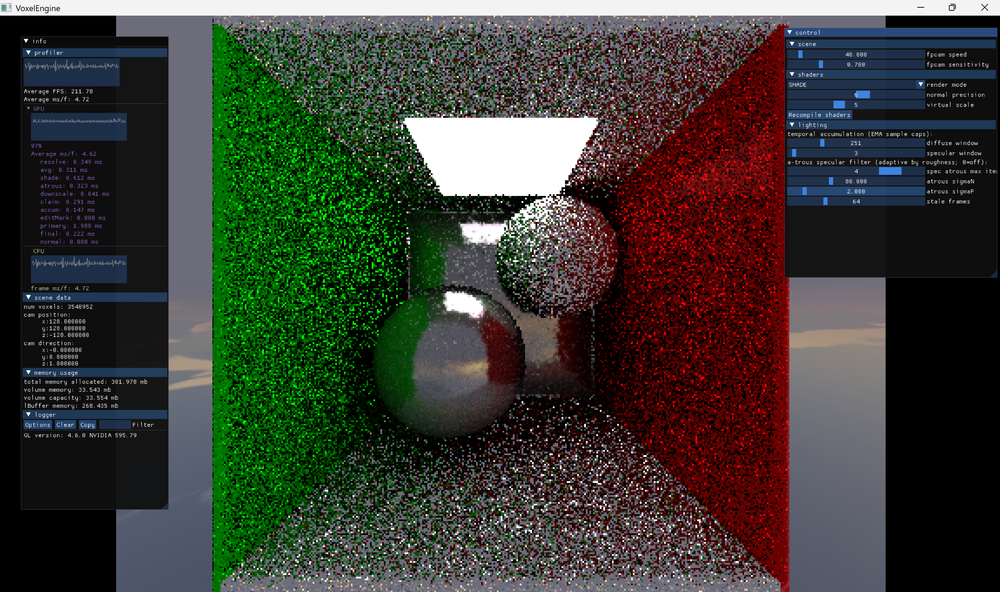
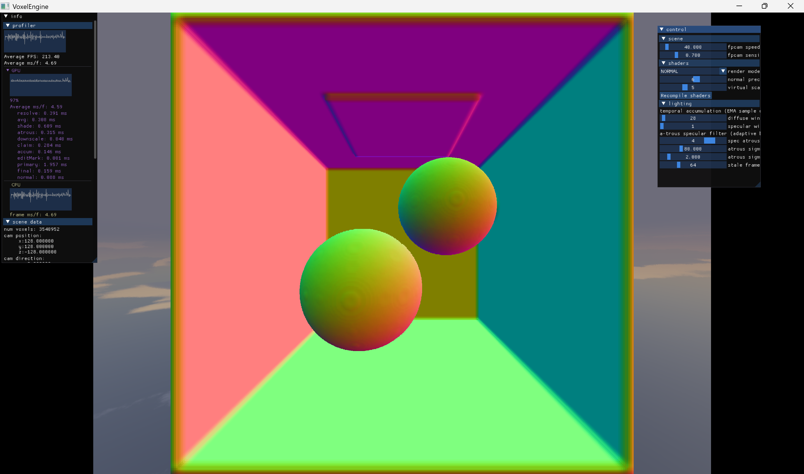
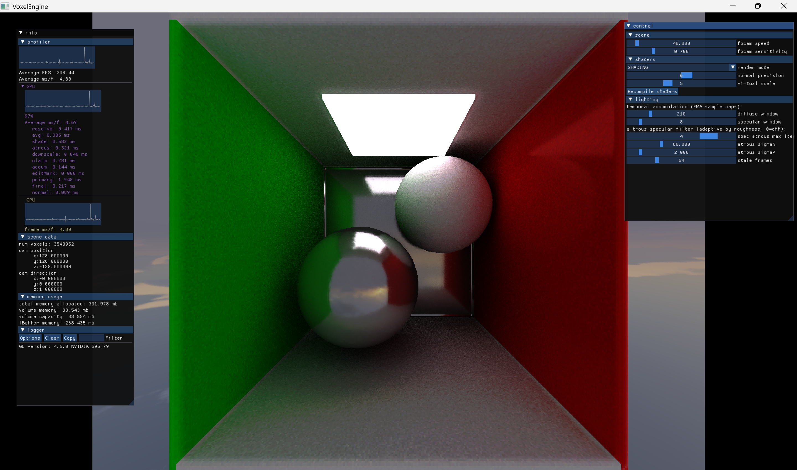

# VoxelEngine 3.0

A real-time **GPU path tracer for sparse voxel octrees**, written in C++ and OpenGL 4.6 compute
shaders. My third-generation voxel engine — it renders fully dynamic scenes of **tens of millions of
voxels** with global illumination (soft shadows, color bleeding, glossy and mirror reflections) at
**hundreds of frames per second**.

The core idea is a **per-voxel irradiance cache** (the *lBuffer*): shading is decoupled from screen
resolution and accumulated in world space per voxel, so a single traced bounce plus cross-frame cache
feedback converges to full multi-bounce global illumination.

## Highlights

- **23 million voxels @ 330+ FPS** (≈3 ms/frame on the GPU) — a depth-9 octree Cornell-box GI scene,
  single NVIDIA GPU.
- **Sparse Voxel Octree** — 64-bit AoS nodes in a single SSBO; branchless, bitwise DDA traversal.
- **Per-voxel irradiance cache** — a flat, hash-indexed, **lock-free** open-addressed table
  (claimed by a single-dispatch CAS on a timestamp word), LRU-evicted; world-space temporal accumulation.
- **Megakernel path tracer** on a downscaled virtual framebuffer — cosine-weighted diffuse + GGX-VNDF
  specular, one bounce + irradiance-cache feedback (≈ unbounded bounces over frames), per-voxel temporal
  EMA + adaptive edge-stop à-trous denoising.
- **Fully dynamic** — live voxel editing and dynamic lighting, with a staleness mechanism that
  re-converges edited/relit regions fast.
- **Sub-millisecond compute passes** — an 11-stage GPU pipeline (primary · claim · normal · downscale ·
  shade · à-trous · accum · avg · resolve · …), each profiled live.

## Performance

*Measured on one NVIDIA GPU (OpenGL 4.6). Frame time is view-dependent — dominated by the primary-ray DDA.*

| Octree depth | Voxels | FPS | GPU frame time | Memory |
|---|---|---|---|---|
| 8 | 3,540,952 | 208 | 4.69 ms | 302 MB |
| 9 | 23,008,548 | 332 | 2.96 ms | 483 MB |

## Images

### Real-time global illumination — depth-9 octree, 23 M voxels


The same view through the render pipeline — the raw single-sample signal, the per-voxel normals, and the
accumulated + denoised output:

| SHADE — raw 1 spp | NORMAL — per-voxel normals | SHADING — converged |
|---|---|---|
|  |  |  |

## Roadmap

- **ReSTIR GI** — spatiotemporal reservoir reuse of the bounce samples for near-instant convergence.
- **Scene import** — `.obj` / mesh voxelization into the octree.
- **LOD & out-of-core streaming** — distance-based coarsening; octree paging for scenes beyond VRAM.

## Build (Windows / MinGW)

Requires the MinGW C++ compiler and CMake ≥ 3.11.

```
git clone https://github.com/AnghelusAndrei/VoxelEngine3.0.git
cd VoxelEngine3.0
mkdir build && cd build
cmake -G "MinGW Makefiles" ..
cmake --build .
```
