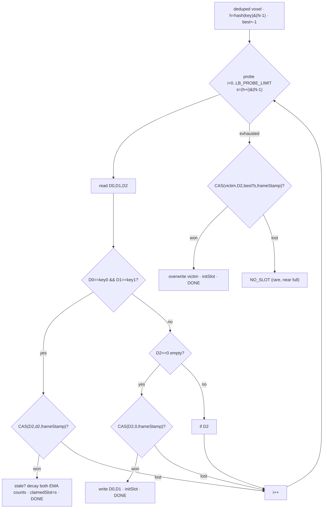

# Lock-Free Claim — Open-Addressing Voxel Hash (as-built, B1.5)

> **Status: IMPLEMENTED (B1.5).** The lBuffer claim is a flat, open-addressed, lock-free
> hash table: `home = hash(key) & (N−1)`, linear probe, ownership taken by `atomicCompSwap`
> on the **timestamp word (D2)**. It replaced the per-bucket-mutex + 128-slot-scan claim,
> killing the claim cost cliff (≈30 ms at depth 9 full-screen) and the per-bucket overflow
> (`LRU_OCCUPANCY` half red). The cache interface (`probeLBuffer`/`claimedSlot`) was
> preserved, so downstream passes were untouched. Source: `src/shd/lbuffer_claim.comp`,
> `src/shd/lbuffer.glsl`; constants in `renderer.hpp`. Slot layout: [LBUFFER.md](LBUFFER.md).

## Why the old bucket + lock claim was replaced (three faults)

1. **Per-bucket lock serialized the bucket.** Every thread — even a *match* — did
   `atomicCompSwap(lock[bucket])`; only one made progress per wave-batch, the rest deferred
   to a retry buffer. Throughput collapsed under contention — the 30 ms, and the reason a
   CPU ping-pong retry loop existed at all.
2. **Full 128-slot scan under the lock, even for matches.** In a coherent scene almost
   every visible voxel is already cached (a match) yet still scanned up to 128 slots while
   holding the lock; bigger buckets → longer critical section.
3. **Fixed per-bucket capacity → overflow from clustering.** With load `N/32768`, a Poisson
   tail pushed some buckets past their slot count even at ~10–25 % *global* load, so voxels
   got `NO_SLOT` (flat-albedo fallback) despite free slots elsewhere.

## The design in one line

One flat slot array; `slot = hash(key) & (N−1)`; **linear-probe**; claim a slot with
`atomicCompSwap` on its **timestamp word (D2)** as a per-slot, per-frame token. No buckets,
no lock buffer, no CPU retry loop — a **single dispatch**.

```
WAS — buckets + lock buffer
  lock[]  (bind 9):  [L0][L1]…[L32767]                    1 uint/bucket (mutex)  ← DELETED
  data[]  (bind 2):  ┌bucket0: slot0..slot127┐┌bucket1…┐ …
  claim:  b=hash%32768 → lock L[b] → scan 128 slots       (serialised; per-bucket cap)

IS — flat open-addressed table
  data[]  (bind 2):  [ slot0 | slot1 | … | slot N-1 ]     (no buckets, no lock buffer)
  claim:  s=hash&(N-1) → probe s, s+1, …                  (lock-free; global load only)
```

Slot is 16 DWORD / 64 B ([LBUFFER.md](LBUFFER.md)). `frameStamp = frameIdx + 1` (never 0),
so `D2 == 0` ⟺ pristine-empty; an occupied slot carries a real key (D0,D1) and a nonzero
`frameStamp`.

## Why it is as safe as the mutex

It keeps mutual **exclusion**, but optimistic and per-slot instead of pessimistic and
per-bucket: every op that owns a slot this frame does `CAS(D2, observed, frameStamp)`, so
**exactly one thread wins a slot per frame** (losers advance the probe — bounded, no spin,
respecting ZERO-SPINLOCK). Safety rests on two invariants the pipeline guarantees:

1. **Dedup — one thread per key.** `primary.comp`'s claim bitfield makes `uniqueVoxelList`
   carry exactly one entry per visible voxel, so two threads never insert the *same* key.
   The only races are *different* voxels colliding on the *same slot*, resolved by the CAS.
2. **`D1 ≠ 0` for every real voxel** (`level ≥ 1`), so all-zero is an unambiguous empty
   sentinel and there is no torn-key ambiguity.

No torn keys (D0/D1 written only by the CAS winner; cross-pass readers run after a
`glMemoryBarrier`). No double-insert (dedup). The one subtle race — a thread *matching* a
slot while another *evicts* it — is closed because both `CAS(D2,…)` the same word; one wins,
the loser re-probes.

## Algorithm (per thread = one deduped voxel)

```glsl
claim(key):                         // key=(pos,level,version); h=hash(key)&(N-1)
  int best = -1; uint bestTs = 0xFFFFFFFFu;
  for (uint i = 0u; i < LB_PROBE_LIMIT; i++) {
      uint s  = (h + i) & (N - 1u);
      uint d2 = data[s].D2;

      if (data[s].D0 == key0 && data[s].D1 == key1) {        // MATCH
          if (atomicCompSwap(data[s].D2, d2, frameStamp) == d2) {
              if (staleFrames != 0 && frameStamp - d2 > staleFrames)
                  drop BOTH EMA counts (diffuse + specular) → ≤1;   // stale: dynamic lighting /
                                                                    // old view → fresh samples dominate
              return s;                                       // keep radiance, refresh LRU
          }
          continue;                                           // evicted under us → keep probing
      }
      if (d2 == 0u) {                                         // PRISTINE EMPTY
          if (atomicCompSwap(data[s].D2, 0u, frameStamp) == 0u) {
              data[s].D0 = key0; data[s].D1 = key1; initSlot(s);  // flag=1, zero channels/accum
              return s;
          } else continue;                                    // taken by another voxel → keep probing
      }
      if (d2 < frameStamp && d2 < bestTs) { bestTs = d2; best = int(s); }   // stalest victim
  }
  if (best >= 0 && atomicCompSwap(data[best].D2, bestTs, frameStamp) == bestTs) {
      data[best].D0 = key0; data[best].D1 = key1; initSlot(best); return uint(best);   // EVICT
  }
  return LB_NO_SLOT;                                          // probe window full this frame (rare)
```



`initSlot` sets `NormalUpdateFlag=1`, zeroes D4–D15, and the winner writes `claimedSlot` back
to `uniqueVoxelList[origIndex].z`. Eviction overwrites (never deletes), so probe chains stay
intact.

## `probeLBuffer` (read-only, all other passes)

Readers in `shade`/`accum`/`resolve`/`edit_mark` keep the same signature; the body is a
bounded linear probe:

```glsl
uint probeLBuffer(uvec3 pos, uint level, uint version) {
    uint h = voxelKey(pos,level,version) & (N - 1u);
    for (uint i = 0u; i < LB_PROBE_LIMIT; i++) {
        uint s = (h + i) & (N - 1u);
        if (data[s].D0 == key0 && data[s].D1 == key1) return s;   // match
        if (data[s].D2 == 0u) return LB_NO_SLOT;                  // pristine empty → absent
    }
    return LB_NO_SLOT;
}
```
(Read-only — no CAS. Stops at the first pristine-empty because linear probing keeps a key
within an unbroken run from its home slot.)

## As-built sizing & tuning

- **`LBUFFER_SLOTS_TOTAL = 2²²`** (4.19 M slots × 64 B = **256 MB**), power-of-two so
  `home = hash & (N−1)`. ≈ 2× peak visible voxels keeps load ≤ 0.5 (~1.5 avg probes).
- **`LB_PROBE_LIMIT = 32`**; exhaustion → `NO_SLOT` (rare at load ≤ 0.5), resolve falls back
  to flat albedo.
- **Linear probe** (cache-friendly: sequential 64-byte lines). If primary clustering shows
  in profiling, switch to double-hashing (`step = 1 + hash2(key) % (N−1)`).
- **Timestamp = monotonic `frameStamp = frameIdx + 1`**, not wall-clock ms — otherwise two
  frames sharing a millisecond would collide and the CAS/eviction guard would misbehave at
  high fps.

## What B1.5 deleted

| | Kept | Deleted | Changed |
|---|---|---|---|
| Cache | key `(pos,level,version)`, 16-DWORD slot, `claimedSlot` write-back, LRU timestamp + eviction guard (`d2<frameStamp`) | per-bucket **lock buffer** (bind 9) | `probeLBuffer` → linear probe |
| Pipeline | `normal/accum/avg` read `claimedSlot`; `shade/resolve/edit_mark` call `probeLBuffer` — untouched | **CPU retry loop**, **retry A/B** (bind 5/6), **retryCount** (bind 7) | `lbuffer_claim` → single dispatch |
| Renderer | — | retry orchestration + `buildArgs` retry-reset | one `claim` dispatch |

Net: three SSBOs and the entire retry machinery gone (one dispatch instead of seven), and
bindings 5/6/7/9 freed.

## Caveats

- Lock-free is more delicate than a mutex: safety lives in applying `CAS(D2,…)` at **all
  three** sites (empty / match / evict) — the review surface.
- The match-loser re-insert (a voxel evicted mid-match) just keeps probing and re-seats —
  correct, a few extra probes, only under eviction pressure.
- `NO_SLOT` fallback in `resolve` stays as the safety net for a genuinely full probe window.
