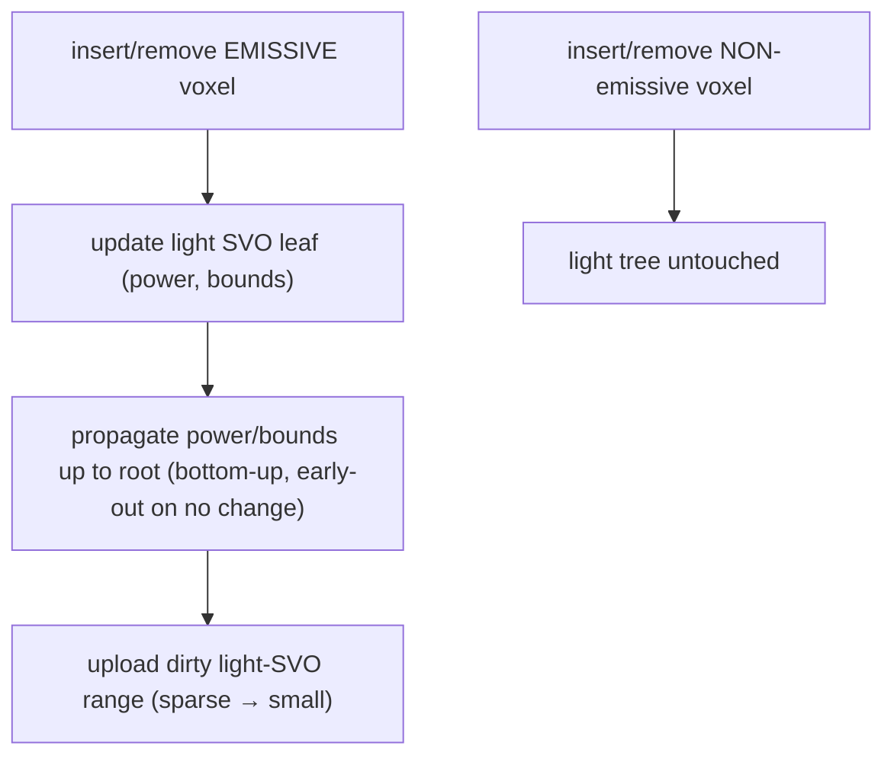
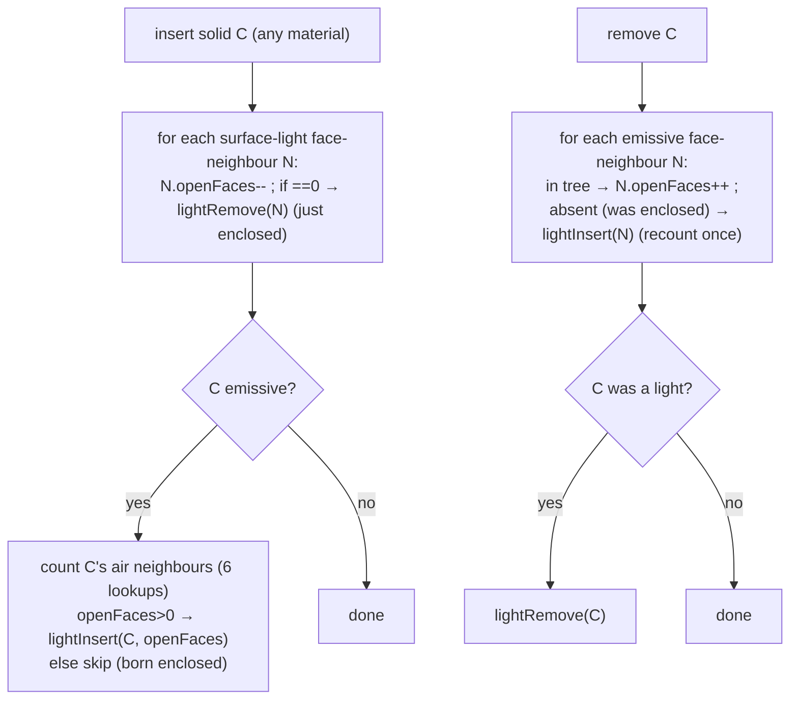

# Light Tree — Emissive-Voxel SVO for NEE / RIS

> **Status: B2.0 BUILT & VERIFIED — the LIGHTTREE debug mode confirms the descent + leaf
> positions; NEE/RIS ride on top (B2, [RESTIR.md](RESTIR.md)). B2.5 adds enclosed-voxel
> surface-culling (§Surface-cull below) — NEXT.** A second, sparse SVO holding
> **only emissive voxels**,
> with light-sampling information summed up the tree. It is the candidate generator for
> RIS-NEE and, later, ReSTIR DI ([RESTIR.md](RESTIR.md)). Rebuilt on the CPU when the
> emissive set changes; the main octree ([OCTREE.md](OCTREE.md)) is untouched. **One
> structure, sampled by descent — no flat alias table.** Source: `lighttree.{hpp,cpp}`,
> `src/shd/lighttree.glsl`; SSBO binding 5; CPU material mirror in `MaterialPool`.

## Why a separate sparse tree (not power in the main octree, not a flat table)

- **Separate, not in the main octree.** Lights are **sparse** — a tiny fraction of leaves
  are emissive. A dedicated emissive SVO only allocates nodes along emissive paths, so it
  is small and shallow. Annotating the main octree with power instead would need a power
  field on *every* node (the `reserved:8` can't hold HDR power → a parallel per-node array
  ≈ 4 B × millions of nodes), bloating the hot structure and forcing light sampling to walk
  the full dense tree. The sparse light tree is both cheaper in memory and faster to sample.
- **Sampled by descent, not a flat alias table.** A power **alias table samples ∝ power
  only** — it cannot account for *where* a light is, so at hundreds–thousands of distributed
  lights most candidates land on irrelevant far/occluded lights and variance stays high.
  **Descending the tree** lets each branch be weighted by power **× spatial/orientation
  importance**, picking *relevant* lights — the real variance win for many lights. It also
  deletes a derived structure (no Vose build, no sync, no re-upload on power change): **one
  tree, one maintenance path.** The descent cost is modest — the sparse tree is shallow
  (~log₈(L) ≈ 4–5 levels for thousands of lights), the top levels are cache-hot, and the
  walk is dwarfed by the shadow + BSDF rays.

Rejected — *GPU-maintained visible-emissive list* (append a light when a ray sees it):
clever as a lazy spatial cull, but it **lags** (an off-screen light that should illuminate a
visible surface is absent until a ray finds it → pop-in on turn), needs a dedup race, and
conflates "lights the camera has seen" with "lights that matter here." The tree's spatial
descent is the principled, non-lagging cull. Kept in the pocket, not built.

## Per-node light data (summed up the tree)

Each SVO node stores the aggregate of its emissive subtree:

| Field | Leaf (emissive voxel) | Internal node | Needed for |
|---|---|---|---|
| `power` | `emissiveIntensity · luminance(color) · faceArea` | Σ children power | descent probability (always) |
| `bounds` | the voxel AABB | union of children AABBs | spatial-aware descent (phase 2) |
| `(optional) cone` | emission axis/spread | bounding cone of children | orientation-aware descent (later) |

Phase-1 descent uses `power` only (trivial). Phase-2 adds the `bounds`/`cone` spatial weight
when variance demands it — same tree, more importance.

## CPU maintenance (mirror of octree material propagation)



Non-emissive edits never touch the light tree. Emissive edits propagate to the root exactly
as `propagateMaterialUp` does for majority material, with the same unchanged-stop early-out.
Only the dirty node range is uploaded (sparse → small). Dynamic emissives (B3) ride this
same path for free.

## Sampling contract (consumed by `shade.comp`)

```glsl
// descend the light SVO: at each node pick a child ∝ power (× spatial weight in phase 2).
// returns the chosen emissive voxel + the selection pdf = Π(branch probabilities).
LightSample sampleLight(vec3 shadingPos, inout uint rng);   // → { voxelKey, faceArea, pdf }
```

RIS draws `M` candidates via `sampleLight`, weights each by its unshadowed contribution to
the shading voxel (`target / pdf`), and resamples to **one** winner that gets the single
shadow ray. The descent pdf is exact (product of branch probabilities), so RIS/ReSTIR stay
unbiased. See [RESTIR.md](RESTIR.md) for the RIS loop and the MIS rule.

## As-built (B2.0)

**GPU node = 3 DWORDs (12 B), flat array at SSBO binding 5** — mirrors the octree's lo/hi
packing plus a power word: `[0]` power (float bits; subtree total or leaf power) · `[1]`
childBase (node-index of the 8-node child block; **0 ⟹ leaf**, like octree `next`) · `[2]`
`isNode:1 | material:7 | childMask:8 | reserved:16` (like octree `lo`). Children are a
**contiguous, non-compacted 8-block** (`childBase + octant`), so descent needs no popcount.
**Position/level/area are not stored** — the descent reconstructs them by accumulating octant
offsets (`origin += octant·(size>>1)`, `size>>=1`) exactly like the octree DDA, so a leaf's
center is `origin + size·0.5`. 12 B × ~75k nodes ≈ 0.9 MB (vs the 33 MB octree). Of the 16
reserved bits in word 2, **3 hold the leaf's `openFaces` count** (B2.5 surface-cull, below); the
remaining 13 are free for a future coarse power-LOD / cone flags (no AABB/cone yet).

**CPU maintenance — a true mirror of the octree (no rebuild, no scan, ever).** The light
tree is its own sparse SVO (`data[]`, 8-node blocks, `allocBlock`/`freeBlock` free-list,
dirty range) maintained exactly like the octree:
- The octree fires a generic **`onLeafChanged(pos, level, oldMat, newMat)`** hook on every
  leaf placement/removal — staying materials-agnostic (it only reports the structural
  change). `LightTree::attach()` registers it.
- The handler applies the **emissive policy**: `newMat` emissive → `lightInsert` (O(depth),
  mirrors `Octree::insert`); else `oldMat` was emissive → `lightRemove` (O(depth), mirrors
  `Octree::remove` with block-freeing). **Power propagates up** per edit, exactly like the
  octree's majority-material propagation (`propagatePowerUp` ≈ `propagateMaterialUp`).
- `flushEdits()` uploads only the **dirty node range** (`glBufferSubData`, in place). The GPU
  buffer capacity grows **geometrically** (doubles), so a growing edit does **not** respecify
  the buffer every frame — mirrors `Octree::resizeDataIfNeeded`. (The earlier per-frame
  `glBufferData` realloc was the emissive-edit stall; in-place sub-update fixed it.)

So an edit costs **O(emissive voxels touched · depth)**, not O(scene) or O(lights), with no
per-frame rebuild and no debounce. The tree is built during the initial scene construction
by the same hook (then one `GenSSBO` upload). Emissiveness/power come from the **CPU material
mirror** in `MaterialPool` (`isEmissive`/`get`).

**Coarse-over-emissive (resolved):** placing a **coarse** (LOD) leaf at `level < depth` over a
finer emissive subtree is handled in `onOctreeLeaf` — the octree fires `onLeafChanged` for the
placed coarse leaf, and the handler reacts to `level < depth` by calling
`lightRemoveSubtree(pos, level)`, which frees the entire finer light subtree in one shot (no
per-leaf hooks). A coarse leaf that is itself emissive then re-inserts a single coarse light.

**Debug:** render mode `LIGHTTREE` (`core::RenderType` 11) descends the tree per visible
voxel and shows the **direction to the sampled light** (`·0.5+0.5`; magenta = no lights) —
verifies descent + leaf positions before NEE rides on top. (During an active drag the view
reflects the last *settled* tree; it refreshes on release.)

## Surface-cull — enclosed-voxel exclusion (B2.5, next)

A **solid** emissive cluster self-occludes its interior: those leaves are sampled by the descent
but contribute ~0 under the strict visibility test → wasted `M` budget / variance
([RESTIR.md](RESTIR.md) §NEE visibility). B2.5 removes them at the source.

**The exact, view-independent rule.** An emissive voxel is a *light* **iff at least one of its 6
face-neighbours is air**. A voxel whose 6 face-neighbours are **all solid** (emissive or not) is
fully enclosed — its emission is absorbed at the neighbour surfaces before reaching any receiver,
from *every* direction — so it is **excluded from the light tree**. This is exact, not a heuristic:
6 solid face-neighbours completely tile the voxel's boundary, so no light leaks through an edge or
corner (the face-only test suffices). An enclosed emissive voxel contributes physically zero
externally, so excluding it changes no image — only deletes always-rejected candidates.

**This is NOT the toward-camera surface cull rejected above.** That rejection stands: culling
voxels that *face away from the camera* is view-dependent and breaks on turn (a "back sphere" in a
line of spheres must stay sampleable). Enclosed-culling is **view-independent** — a back-sphere
voxel keeps air on its back face, so `openFaces > 0`, so it is kept. The two are different
operations; only the view-dependent one was ever wrong.

**State — `openFaces` ∈ [0,6], 3 bits, in the light-tree leaf's `reserved:16` (word 2).** It exists
exactly while a voxel is a *surface* light (present in the tree). An enclosed voxel is absent and
needs no stored count. No octree-node change, no parallel array, no extra octree GPU traffic.

**Maintenance — rides the existing `onLeafChanged(pos, level, oldMat, newMat)` hook, extended to
visit the 6 face-neighbours.** The asymmetry keeps it cheap: *adding* opacity can only enclose;
*removing* it can only open.



The **enclose** transition is O(1) (decrement-and-test) precisely because the count lives in the
leaf that is currently present; the rare **un-enclose** recounts in 6 `Octree::lookup`s.

**Cost: O(depth) per edit**, constant ≈ 12 (≤6 neighbour `lookup`s + ≤6 light-tree descents/edits,
each O(depth)) — meeting the project's "O(depth) per octree edit" bar. Build rides the same hook
(each insert stays O(depth)); if a deep-scene build regresses on the ~12× per-emissive-insert
constant, the fallback is a **one-shot post-build surface scan** (each emissive checks 6 neighbours
once) — but try the incremental path first (§1E: don't add a second path until the first measurably
hurts). Coarse leaves: `Octree::lookup` returns a covering coarse leaf as solid, so neighbour
occupancy stays correct under future LOD; query neighbours at the voxel's own `level`.

**What it does and doesn't fix.** Surface-cull removes the *interior-occlusion* variance of **solid
blobs**. It does **nothing** for a 1-voxel-thick plate (every voxel has air on two faces → none
enclosed) — that emitter's noise is the grazing point-on-voxel pattern, fixed by **area-face
sampling** ([RESTIR.md](RESTIR.md) §NEE visibility). Residual surface-candidate variance (many
relevant lights, penumbrae) is later addressed by **phase-2 descent importance** (per-node
bounds/cone) + **ReSTIR reuse**, keeping the tree otherwise complete.
