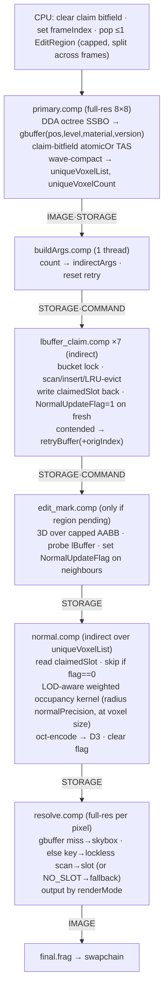

# Milestone A — Per-Voxel Cache Validation (no lighting)

> **STATUS: IMPLEMENTED & VERIFIED.** primary(gbuffer+dedup) · buildArgs ·
> lbuffer_claim(try-lock ping-pong) · edit_mark · normal · resolve all live. Normal
> encoding is **3×10-bit** (octahedral deferred); DWORD3 = `flag[0]|spare[1]|z|y|x`.
> `frameTime` = wall-clock ms. Retries + normalPrecision are live UI sliders.
> Verified: 229K deduped voxels, 99.9% claimed, unit normals, edit_mark flag set.
> Depth-9 cache thrash is a *capacity* limit deferred to Stage 3 (LOD/paging).

**Goal:** exercise the entire per-voxel data path end-to-end — DDA → dedup →
claim → persistent lBuffer slot → runtime normal generation → edit invalidation →
resolve readout — and prove it with *visually verifiable* output, **before** any
lighting / virtual-res / accumulation exists. If this is solid, every later stage
is built on proven plumbing. See [ROADMAP.md](ROADMAP.md) Stage 1.

**Done when:** OCTREE, MATERIAL, and NORMAL render modes all read correctly from
the lBuffer, with normals **computed at runtime per unique visible *marked*
voxel** and cached across frames; plus debug modes VERSION / CLAIM_AGE /
LRU_OCCUPANCY. Edit a voxel at runtime → affected normals visibly refresh.

## In / out of scope

| In | Out (Stage 2+) |
|---|---|
| `primary` (gbuffer + claim), `buildArgs`, `lbuffer_claim` (×7 retry), `edit_mark`, `normal`, `resolve`, `final` | `shade`, `accum`, `avg`, `buildAvgArgs`, virtual framebuffer, `shadedVoxelList`, temporal channels |
| lBuffer slot DWORDs 0–4 only | lBuffer DWORDs 5+ (radiance/temporal) |
| OCTREE / MATERIAL / NORMAL + 3 debug modes | SHADING mode |

---

## Octree node — add `version` (foundation edit)

Lo word becomes `[isNode:1 | material:7 | childmask:8 | version:8 | reserved:8]`
([OCTREE.md](OCTREE.md)). **`version` = a single global insert counter:** every
`Octree::makeLeaf` stamps `version = (++globalVersion) & 0xFF`. No per-slot
persistence. Collisions only if the same `(pos,size)` is re-created exactly a
multiple of 256 inserts apart — negligible. `primary` reads `version` from the
hit node and folds it into the key.

**`version` and `edit_mark` do *different* jobs** (both required):
- **`version`** covers a voxel whose *own* incarnation changed (edited material /
  removed+reinserted) → new key → fresh slot, old entry ages out.
- **`edit_mark`** covers a voxel whose *neighbour* changed: its occupancy-derived
  normal is now stale even though it was not itself edited and its version (hence
  key) is unchanged. `edit_mark` re-flags those neighbours for recompute.

---

## Buffers

**lBuffer slot — 5 DWORDs / 20 B** (minimal now; grows when lighting lands — we
watch memory evolve rather than pre-pay 16 DWORDs):

| DWORD | Contents |
|---|---|
| 0 | `pos.x[0:15] \| pos.y[16:31]` |
| 1 | `pos.z[0:15] \| sizeLevel[16:23] \| version[24:31]` |
| 2 | `timestamp` (LRU frame index) |
| 3 | `octNormal[0:29] \| NormalUpdateFlag[30] \| spare[31]` |
| 4 | spare (future) |

- **Identity / key** = DWORD0 + DWORD1 (`pos, sizeLevel, version`). Empty slot =
  `D0==0 && D1==0`; safe because a real leaf has `sizeLevel ≥ 1` (level 0 = root),
  so even a voxel at origin has `D1 ≠ 0`.
- **`sizeLevel`** = octree level (log2 of edge length), not raw size — compact and
  1:1 with size.
- **Normal** = octahedral, 2×15-bit in one DWORD (uniform angular error, no poles,
  no transcendentals — chosen over spherical and raw R10G10B10).

**`uniqueVoxelList` — `uvec4` per entry:** `{pos_xy, pos_z|sizeLevel|version,
claimedSlot, spare}`. `primary` writes DWORD0–1; `lbuffer_claim` writes
`claimedSlot` (linear lBuffer slot, or `NO_SLOT = 0xFFFFFFFF`). Downstream
per-voxel passes read `claimedSlot` directly — **no bucket scan, no lock.**

**Claim bitfield** ([OCTREE.md](OCTREE.md)): cleared each frame before `primary`.
**gbuffer:** carries `pos, sizeLevel, material, version` (resolve rebuilds the key
from it).

---

## Locking model (settled)

The bucket lock is **claim-only**. Once `lbuffer_claim` has seated every voxel in
a unique slot, no further inter-slot movement happens this frame, so all
downstream passes read **and** write their own slot lock-free.
- `normal.comp` (per unique voxel): direct `claimedSlot` from the list.
- `resolve.comp` (per **pixel**, no list index): read-only **lockless bucket
  scan** by key. (A future pass could write slot indices into the gbuffer to make
  resolve scan-free too — deferred; also benefits Stage 2.)

---

## Per-frame pass order

---

## Normal generation

Weighted occupancy gradient over a **sphere of radius `normalPrecision` (=6)**,
sampled **at the voxel's own size** (`sizeLevel`), i.e. neighbour cells are spaced
by the voxel's edge length and tested with a leveled `octreeOccupied(pos, level)`
descent — so it is correct for every leaf size (LOD-general), reducing to the
existing ~13³ unit-spacing kernel at max resolution. `editExpandRadius =
normalPrecision` so an edit re-flags exactly the voxels whose kernel reaches it.

## Render modes (`renderMode` uniform → resolve)

`OCTREE` (sizeLevel-shaded) · `MATERIAL` (material UBO colour) · `NORMAL` (decoded
oct normal) · debug `VERSION` · `CLAIM_AGE` (frameIndex − timestamp) ·
`LRU_OCCUPANCY` (slot found / bucket fill). Extend `core::RenderType` + a UI
selector.

## New GLSL

`shd/lbuffer.glsl` — `voxelKey/bucketIndex/slotBase`, `probeLBuffer(key)`,
`octreeOccupied(pos,level)`. `internal.glsl` stays ray-DDA-only. New comps target
`#version 460`; only `primary` needs the subgroup extensions (wave compaction).

## Implementation notes / residual detail

- **Retry + slot-writeback:** `retryBuffer` entries must carry the **original
  `uniqueVoxelList` index** so a voxel claimed on a later iteration still writes
  its `claimedSlot` back to its original list slot (where `normal.comp` reads it).
- **NO_SLOT fallback:** if >32 visible voxels hash to one bucket, the overflow
  gets `claimedSlot = 0xFFFFFFFF`; `normal` skips it, `resolve` falls back to
  material colour / neutral normal.
