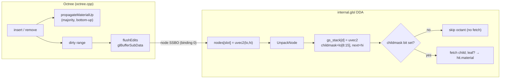

# Octree Structure — 64-bit Node Format & GPU Buffers

**Status: IMPLEMENTED.** This document describes the live structural foundation
(`src/renderer/octree.{hpp,cpp}`, `src/shd/internal.glsl`, `src/shd/primary.comp`).
It supersedes the old 32-bit single-word node and the "Stage 3" 64-bit plan in
[ROADMAP.md](ROADMAP.md), and it replaces the texture-buffer octree + `lockBuffer`
dedup described in earlier drafts of [PIPELINE.md](PIPELINE.md).

---

## Node Format — 64 bits, AoS, single SSBO

Each node is two 32-bit words (`lo`, `hi`) stored interleaved in one SSBO
(`uvec2 nodes[]`). CPU `Octree::Node` and GLSL `UnpackNode` mirror these exact
bit positions — both sides use explicit shift/mask (no C++ bitfields, whose bit
order is implementation-defined).

```
Lo word: [ isNode:1 | material:7 | childmask:8 | version:8 | reserved:8 ]
Hi word: [ next:32 ]
```

| Field | Bits | Internal node | Leaf node |
|---|---|---|---|
| `isNode`    | lo[0]      | 1 | 0 |
| `material`  | lo[1:7]    | majority of children (representative) | the voxel's material |
| `childmask` | lo[8:15]   | 1 bit per occupied octant | 0 (unused) |
| `version`   | lo[16:23]  | incarnation counter (8-bit, wraps mod 256) | same |
| `reserved`  | lo[24:31]  | free (8 bits) | free |
| `next`      | hi[0:31]   | child-block base slot | 0 (unused) |

**`version`** is the third component of the lBuffer key, alongside `(pos, size)`.
It disambiguates *incarnations* of a voxel: if a voxel is modified while
off-screen and later returns at the same `(pos, size)`, the bumped version yields
a different hash key, so its stale cached lBuffer entry (normals/radiance) is not
reused — it ages out via LRU and the voxel re-claims a fresh slot. `primary.comp`
reads `version` from the node during the DDA and folds it into the key it writes
to `uniqueVoxelList`. *Increment policy is unsettled — see §Discussion.*

**Key invariant:** `material` lives at the *same* bits for leaves and internal
nodes. A traversal that stops early at an internal node (LOD) reads its
representative material with the same code path as a leaf — no branch on type.

**Empty slot** = `lo == 0 && hi == 0`. **Material 0** is the empty/sky sentinel
and is never inserted.

The per-voxel **normal is no longer stored in the node** — it lives in the
lBuffer ([LBUFFER.md](LBUFFER.md) DWORD3), recomputed by `normal.comp`. This
freed the 24 bits the old leaf spent on a normal.

---

## Why AoS in one SSBO (not SoA lo/hi split)

- **Cache line = block.** `sizeof(Node) == 8 B`, blocks are 8 slots and
  **8-slot aligned** (the root's child block starts at slot 8; slots 1–7 are
  padding; `allocBlock` keeps `size` a multiple of 8). So one 8-child block =
  64 B = exactly one L2 cache line — directly satisfies PHILOSOPHIES.md's
  64-byte alignment rule. A warp of coherent primary rays descending the same
  block reads one line.
- **One upload path.** A single dirty range → one `glBufferSubData`; a single
  `glBufferData` on growth. SoA would double every buffer op and force the CPU
  to maintain two parallel arrays.
- **lo/hi adjacency.** Internal-node traversal needs both words (childmask from
  `lo`, `next` from `hi`); interleaving keeps them in the same line.

Trade-off accepted: a leaf read pulls its unused `hi` into cache. It is in the
same line regardless, so the cost is nil.

---

## GPU Buffers (owned by `Octree`)

| Buffer | Binding | Type | Size | Purpose |
|---|---|---|---|---|
| node buffer | `SSBO_OCTREE_BINDING = 0` | `uvec2[]` | `capacity × 8 B` | the tree; read by the DDA |
| claim bitfield | `SSBO_CLAIM_BINDING = 1` | `uint[]` | `⌈capacity/32⌉ × 4 B` | 1 bit/slot voxel dedup (see below) |

Binding numbers are defined once in `core.hpp` (`core::SSBO_*_BINDING`) and
mirrored as `binding = N` literals in the shaders. The lBuffer
(`SSBO_LBUFFER_BINDING = 2`) is owned by `Renderer`, not `Octree`.

Both octree buffers are reallocated together in `resizeDataIfNeeded` (capacity
doubles), so slot *N* always has a backing claim bit. The old
`GL_MAX_TEXTURE_BUFFER_SIZE` cap is gone — an SSBO is bounded by
`GL_MAX_SHADER_STORAGE_BLOCK_SIZE` / VRAM.

### Claim bitfield — dedup mechanism

Replaces the frame-indexed `lockBuffer` from earlier drafts. One **bit** per
octree slot (32× less memory than a `uint`-per-slot lockBuffer). `primary.comp`
(next stage) claims each visible voxel exactly once:

```glsl
uint w = hit.id >> 5u, b = 1u << (hit.id & 31u);
bool firstThisFrame = (atomicOr(claim.bits[w], b) & b) == 0u;   // append if true
```

Unlike the self-resetting frame-index scheme, the bitfield must be **explicitly
cleared each frame** (a `glClearBufferData` or tiny compute pass before
`primary.comp`). Open tradeoff — see §Discussion.

*Currently allocated and zero-initialised but unread:* no pass claims voxels
yet. The single-pass `primary.comp` writes colour directly for now.

---

## Representative material — majority propagation

On every `insert`/`remove`, the descent path is recorded and materials are
recomputed **bottom-up** (`recomputeMaterial` / `propagateMaterialUp`):

- An internal node's `material` = the **majority** material over its **non-empty
  direct children** (ties → lowest id). An internal child contributes its own
  already-propagated representative (one vote, regardless of subtree size).
- **Early-out:** stop climbing once a node's material is unchanged — a parent's
  majority can only shift if a child's did. Makes the common edit O(1)
  amortised; worst case O(8·depth).
- `remove` propagates to the **root** even when no block is freed (a removal can
  shift majorities all the way up); freed ancestors are skipped.

This differs from the old "last-write `reprMaterial`" plan. It is **not yet
consumed** by any pass (the DDA still descends to leaves) — it is the substrate
for LOD ([ROADMAP.md](ROADMAP.md) Stage "LOD") and the hierarchical material
cache.

---

## Capacity & depth scaling

`next` is now a full 32-bit slot index (max ~4.29 B slots), retiring the old
23-bit / 8.39 M-slot ceiling. Measured on the test scene (`voxelengine.cpp`):

| Depth | Voxels | Slots (`size`) | `capacity` | Node SSBO | Claim |
|---|---|---|---|---|---|
| 8 | 3.54 M | 4.19 M | 2²² = 4.19 M | 33.5 MB | 0.5 MB |
| 9 | 23.0 M | 26.9 M | 2²⁵ = 33.6 M | **268 MB** | 4.2 MB |

Depth 9 **exceeded** the old 23-bit `next` limit (26.9 M ≫ 8.39 M) — which is
why it failed before this change and works now. **Consequence:** the pointer no
longer limits depth, but **VRAM does**. Each +1 depth on a surface-heavy scene
is ≈ 4–8× the slots. This makes LOD/coarsening and paging *more* urgent, not
less — see [ROADMAP.md](ROADMAP.md).

---

## CPU ↔ GPU traversal (mirror)



---

## Discussion / open tradeoffs

1. **Claim bitfield false-contention.** 32 sibling slots share one `uint`. A
   warp of coherent rays hitting one block `atomicOr`s the same word →
   serialised, where a `uint`-per-slot lockBuffer had none. Memory win is 32×;
   the question is whether the atomic contention shows up in profiling. Could
   hybridise (word-per-slot in hot region) if it does.
2. **Majority vs. stability.** Majority is "most-representative" but can flicker
   as edits flip a tie; last-write is cheaper and stable but less faithful. Also
   "majority of *direct children's representatives*" ≠ "majority of *leaves in
   the subtree*" — a sparse child outvotes a dense one. Open question for LOD
   fidelity.
3. **`reserved:8` in `lo`.** Free for a future embedded lock/flags if the
   separate claim bitfield is ever retired.
4. **`version` increment policy — SETTLED (b), in code since Milestone A.** A single
   global insert counter is stamped on every leaf: `makeLeaf(material, (++versionCounter)
   & VER_MASK)` (`octree.cpp:387`). Trivial, no persistence logic; the alternative (a)
   (preserve version through a single-leaf remove) had a residual edge case when the
   remove also freed the block. Collision only if the same `(pos,size)` is re-created
   exactly a multiple of 256 inserts apart (astronomically rare). This is what lets a
   re-incarnated voxel invalidate its stale lBuffer entry **and** its ReSTIR reservoir
   ([RESTIR.md](RESTIR.md)).
