# Pipeline — Per-Voxel Irradiance-Cache Path Tracer

How a frame is produced. Slot layout and cache internals: [LBUFFER.md](LBUFFER.md). Node format
and GPU buffers: [OCTREE.md](OCTREE.md). Driving it, and materials: [USAGE.md](USAGE.md).

## What it is

Primary rays find visible voxels at full resolution. Shading runs on a **downscaled virtual
framebuffer** as a megakernel path tracer: one cosine diffuse ray + one GGX-VNDF specular ray, each
a single bounce that reads the **previous frame's** per-voxel cache at the hit — irradiance-cache
feedback, so bounces compound across frames. Direct light *is* the diffuse bounce landing on an
emissive voxel; visibility is built in, there is no shadow ray. The skybox is the other light.
Per-frame samples scatter into per-voxel accumulators and fold into the cache through a
variance-adaptive EMA. `resolve` reads that cache at full resolution and composites.

---

## Frame

```mermaid
flowchart TD
    CPU["CPU Renderer::run\nclear claim bitfield + uniqueVoxelCount\nlatch frameStamp · pop ≤1 EditRegion"] --> P1
    P1["primary.comp — full-res 8×8\nDDA octree → gbuffer (pos, level, material, version, vid)\nreads only · miss = uvec4(0)"]
    P1 -->|IMAGE| DS["downscale.comp — virtual-res 8×8, subgroup\njittered 1-of-scale² sample → virtual gbuffer\nclaim-bitfield atomicOr TAS by vid\nwave-compact → uniqueVoxelList + count"]
    DS -->|IMAGE·STORAGE| BA["buildArgs.comp — 1 thread\nuniqueCount → indirectArgs[0]"]
    BA -->|STORAGE·COMMAND| CL["lbuffer_claim.comp — indirect, single dispatch\nlock-free open addressing · CAS on timestamp\nwrite claimedSlot + listIndex · bake slot offset into node"]
    CL -->|STORAGE| EM["edit_mark.comp — 3D, ≤1 region/frame\nre-flag NormalUpdateFlag around an edit"]
    EM -->|STORAGE| NM["normal.comp — indirect per voxel\noccupancy-gradient normal → D3, clear flag"]
    NM -->|STORAGE| SH["shade.comp — virtual-res 8×8 (megakernel PT)\nONE lookupLBuffer: normal + listIndex off one line\nworld-keyed RNG · cosine diffuse + GGX-VNDF specular\n1 bounce + cache feedback · firefly clamp\nstamps listIndex into virtual gbuffer .z"]
    SH -->|IMAGE·STORAGE| AC["accum.comp — virtual-res 8×8\ngid = VGListIdx(gbuffer) · no lBuffer, no octree, no hash\natomicAdd HDR fixed-point sums + pixelCount"]
    AC -->|STORAGE| AV["avg.comp — indirect per voxel\nframeMean = sum/(pixels·SCALE)\nvariance-adaptive EMA → RGB9E5 channels\nupdate log-luminance mean + variance"]
    AV -->|STORAGE| HF["holefill.comp — virtual-res 8×8\none lookupLBuffer per texel, no filtering\nchannels + per-tap confidence → holeFill"]
    HF -->|IMAGE| RS["resolve.comp — full-res 8×8\nmiss→skybox · else lookupLBuffer (O(1) baked offset)\nunserved channel → confidence-weighted bilinear over holeFill"]
    RS -->|IMAGE| FN["final.frag — fullscreen quad → swapchain"]
```



`buildArgs` runs once; `claim`, `normal` and `avg` all dispatch indirectly over the same
`uniqueVoxelList` (`uniqueCount` is fixed after `downscale`, and none of them touch `indirectArgs`).

---

## Passes

### primary.comp — full-res `8×8`
DDA-traces the octree and writes the gbuffer. Does not dedup.
- **gbuffer** (RGBA32UI): `x = pos.x|pos.y`, `y = pos.z|level<<16|version<<24`, `z = material`,
  `w = vid` (octree node id). Miss → `uvec4(0)`, i.e. `level == 0`, which is the canonical miss test.
- Barrier `IMAGE`.

### downscale.comp — virtual-res `8×8`, subgroup extensions
Each virtual texel samples ONE full-res texel at `vp*scale + jit`. `jit` is semi-deterministic: a
per-pixel `phase` hashed from `vp`, advanced by `jitterStride * (frameIndex % S)` mod `S = scale²`,
with `jitterStride` chosen coprime to `scale` on the host. Every pixel therefore walks all `S`
sub-tile offsets exactly once per `S` frames. Per-pixel phase breaks the structured coverage a global
offset bakes in; the coprime stride guarantees complete coverage.
- **Dedup:** `atomicOr` on the claim bitfield by `vid` — one append per unique node, wave-compacted
  (`subgroupBallot` / `…ExclusiveBitCount` / `subgroupElect`) into `uniqueVoxelList` and
  `uniqueVoxelCount`. Deduping here rather than at full res means only the texels actually shaded get
  claimed.
- Barrier `IMAGE | STORAGE`.

### buildArgs.comp — 1 thread
`indirectArgs[0] = ⌈uniqueCount / 64⌉`. Barrier `STORAGE | COMMAND`.

### lbuffer_claim.comp — indirect, local `64`, single dispatch
Seats every visible voxel in the cache and bakes its probe distance into the octree node. Full
algorithm: [LBUFFER.md](LBUFFER.md). Barrier `STORAGE`.

### edit_mark.comp — 3D `4×4×4`, ≤1 region/frame
Pops one `EditRegion` AABB (capped at 64³, split across frames if larger); for each lattice point
descends to the resident leaf and `atomicOr`s `NormalUpdateFlag` so `normal.comp` recomputes
neighbour normals whose occupancy changed. Barrier `STORAGE`.

### normal.comp — indirect per voxel, local `64`
Skips unless `NormalUpdateFlag` is set. Occupancy-gradient normal over a weighted sphere of radius
`normalPrecision` sampled at voxel size, packed 3×10-bit into D3 with the flag cleared.
Barrier `STORAGE`.

### shade.comp — virtual-res `8×8` (megakernel path tracer)
1. Read the virtual gbuffer → primary voxel; reconstruct `centre`, `V`.
2. **One `lookupLBuffer`** serves the whole texel: the cached normal (D3) and this voxel's
   `listIndex` (D7) are on the same 64 B line. The index is stamped into the virtual gbuffer's spare
   `.z` bits so `accum` needs no lookup of its own. Normal falls back to a radius-2 occupancy kernel
   when absent.
3. **RNG seed = world voxel identity** (`lb_hash` of `gb.pos`, with `frameIndex` and `vp` mixed in as
   secondary terms). Seeding by screen pixel bakes a screen-periodic error into a world-space cache.
4. **Diffuse:** one cosine-weighted ray from `centre + N·(0.87·vsize + 0.5)`. `traceRadiance` returns
   emission on an emissive hit (**that is the direct light**), else sky + the hit voxel's cached
   diffuse. Firefly-clamped.
5. **Specular:** one GGX-VNDF ray (`sampleGGXVNDF` + `F·G1(L)` throughput), gated on `dot(L,N) > 0`
   and `material.specular > 0.01`.
6. Writes `virtualDiffuse` (E/π) and `virtualSpecular`. Barrier `IMAGE | STORAGE`.

### accum.comp — virtual-res `8×8`
`gid = VGListIdx(virtual gbuffer)`, then `atomicAdd` the firefly-clamped samples (HDR fixed-point
×`ACCUM_SCALE`) into `accumDiffuse[gid].xyz` / `accumSpecular[gid].xyz` and `+1` into
`accumDiffuse[gid].w`. Touches **neither the lBuffer nor the octree** — `shade` already resolved the
index. `VG_LISTIDX_NONE` covers sky and voxels that never seated. Barrier `STORAGE`.

### avg.comp — indirect per voxel, local `64`
Early-out on `pixels == 0` (not sampled this frame → keep history). Folds this frame's mean into the
cached channels and updates the variance tracker: [LBUFFER.md](LBUFFER.md) § Accumulate and temporal blend.
Barrier `STORAGE`.

### holefill.comp — virtual-res `8×8`
One `lookupLBuffer` per texel, no filtering. Exists to hoist the expensive half of the fill (node
read + hash chain + scattered 64 B line) out of the full-res loop, where every pixel in a `scale²`
tile repeated it. Each channel is published only if its EMA count is non-zero and it is inside its
staleness window; otherwise `IRR_HOLE`.

Output `holeFill` (RGBA32UI, virtual-res):

| | Contents |
|---|---|
| `x`, `y` | diffuse / specular, RGB9E5 exactly as the lBuffer stores them, or `IRR_HOLE` |
| `z`, `w` | the texel's voxel key (gbuffer `.xy` layout), with `version` replaced by a **confidence** byte |

Confidence is `1 / (1 + v/n)` from the variance and sample count already on the fetched line — the
squared standard error of the stored mean. It costs nothing and is strictly better than gating on
sample count, which says how *much* was measured but not how much it disagreed. Barrier `IMAGE`.

### resolve.comp — full-res `8×8`
Miss → skybox **without touching the cache** (the lookup is guarded on `gb.hit`; a sky pixel would
otherwise pay a node read, a hash chain and a scattered fetch only to discard them). On a hit,
`lookupLBuffer(pos, level, version, octree.nodes[gb.vid].x)` — the O(1) baked-offset read, not a
probe — then each channel is taken only if inside its staleness window, else marked `IRR_HOLE`.

`SHADING` composites `(1-metallic)·albedo·diffuse + specular + (emissive ? emission : 0)`.

**Cache-hole fill (`holeFillAt`).** An unserved channel is reconstructed by a gated bilinear over
`holeFill`, four coherent image loads:

```glsl
c    = (pix + 0.5)/virtualScale - 0.5;   // texel vp is centred at vp*scale + (scale-1)/2
base = floor(c);  t = c - base;
w    = bilinear(t) × HFConfidence(tap)
```

A tap is dropped when its channel is `IRR_HOLE` or its level differs; surviving weights
**renormalize**, which is the trick — a bilinear that skips invalid taps and renormalizes *is* a 2×2
gather, so a sparse field still reconstructs. The taps are skipped entirely when both channels came
from the cache. If nothing survives the channel stays **black**, never flat albedo. Barrier `IMAGE`.

### final.vert / final.frag
Fullscreen quad samples `resolveTexture` → swapchain (or the offscreen target when
`renderToTexture`). No tone mapping.

---

## Buffers

| Name | Type | Format | Notes |
|---|---|---|---|
| `gbufferTexture` | uimage2D | RGBA32UI, full-res | pos/level/material/version/vid; miss = 0 |
| `OctreeBuffer` | SSBO `uvec2[]` (bind 0) | — | 64-bit nodes ([OCTREE.md](OCTREE.md)) |
| `ClaimBuffer` | SSBO `uint[]` (bind 1) | — | 1 bit/node dedup TAS; cleared each frame |
| `lBuffer` | SSBO `uint[]` (bind 2) | — | 16-DWORD slot, 2²² slots, **256 MB** ([LBUFFER.md](LBUFFER.md)) |
| `uniqueVoxelList` | SSBO `uvec4[]` (bind 3) | — | `{key.xy, claimedSlot, vid}`; virtual-pixel count |
| `uniqueVoxelCount` | SSBO `uint` (bind 4) | — | cleared each frame |
| `indirectArgs` | SSBO `uvec4[2]` (bind 5) | — | claim/normal/avg dispatch args |
| `accumDiffuse` | SSBO `uvec4[]` (bind 6) | — | per-list-entry diffuse sum + `pixelCount` |
| `accumSpecular` | SSBO `uvec4[]` (bind 7) | — | per-list-entry specular sum |
| `MaterialBuffer` | SSBO `Material[]` (bind 8) | — | 1024 × 64 B; an SSBO because that exceeds any UBO |
| `virtualGBuffer` | uimage2D | RGBA32UI, virtual-res | downscaled key; `.z` spare bits carry `listIndex` |
| `virtualDiffuse` | image2D | RGBA32F, virtual-res | incident diffuse E/π |
| `virtualSpecular` | image2D | RGBA32F, virtual-res | specular outgoing radiance |
| `holeFill` | uimage2D | RGBA32UI, virtual-res | channels + voxel key + confidence |
| `resolveTexture` | image2D | RGBA32F, full-res | → final.frag |

> Binding numbers live in **one** place: `core.hpp` (C++) and `shd/constants.glsl` (GLSL), mirrored by
> hand. Shaders must use the `SSBO_*_BINDING` defines, never a numeric literal — a shader writing to
> an unbound point fails **silently**. Bindings 9+ are free.

### Spare-bit contracts

Two images carry extra fields in bits their primary consumer does not read. Both are declared with
accessors in `gbuffer.glsl`, never as ad-hoc shifts:

| Field | Lives in | Why it is free |
|---|---|---|
| `VGListIdx` | virtual gbuffer `.z` bits 10..31 | `material` needs only 10 bits |
| `HFConfidence` | `holeFill.w` bits 24..31 | `resolve` gates on `pos`/`level`, never `version` |

The list index caps the virtual framebuffer at 4.19 M texels; `allocVoxelLists` logs if exceeded.

---

## Shader specialisation

`shader::compile` injects a `Defines` block immediately after the `#version` line — ahead of every
`#extension` and `#include`, so headers see it. `Renderer::shaderDefines()` builds the set every pass
shares and each pass owns its copy, so `link()`/`reload()` take no shader arguments and a hot reload
cannot drift from the original build.

```cpp
shader::Defines()
    .include("constants.glsl")                       // bindings, slot layout, render modes
    .define("MAXDEPTH", volume->depth + 1)           // sizes internal.glsl's shared-memory stack
```

`constants.glsl` is injected rather than `#include`d per shader, so the pipeline's shared vocabulary
has one declaration site. `MAXDEPTH` sizes `shared uvec2 gs_stack[MAXDEPTH][64]` — 512 B per level per
workgroup, and shared memory is what caps occupancy in `primary`/`shade`, so it must be the octree
actually in use, not the compile-time ceiling. `internal.glsl` has **no default** for it and `#error`s
instead: a silent fallback would still compile and still render, just at half occupancy.

`Library` collects every pass; `linkAll` / `reloadAll` / `destroyAll` are one call each. `PassUBO`
flags bind UBO blocks on every link *and* relink. `ComputePass::dispatch` and `FinalRasterPass::draw`
bind their own program, so no call site binds one by hand.

---

## Parameters (`core::FrameConfig` + UI)

| Parameter | Default | Notes |
|---|---|---|
| `primary_raystop` | 100 | max DDA steps |
| `normalPrecision` | 6 | normal kernel radius, voxel-size units |
| `virtualScale` | 5 | shading downscale divisor |
| `emaDiffuse` | 140 | diffuse window **at unit variance** — the reference, not a cap ([LBUFFER.md](LBUFFER.md)) |
| `emaSpecular` | 4 | specular window; short so specular stays view-responsive |
| `staleViewDep` | 50 | frames before a specular channel is refused as stale |
| `staleViewIndep` | 1e7 | effectively an eviction control, not a freshness gate: diffuse irradiance is view-independent |

Shader-side constants that behave like tunables live in `constants.glsl`: `HOLE_RADIUS`,
`VAR_ALPHA_MIN`/`MAX`, `VAR_WINDOW_EPS`/`MIN`, `LUM_FLOOR`, `FIREFLY_CLAMP`, `ACCUM_SCALE`.

---

## Debug modes

`renderMode` mirrors `core::RenderType` and the `MODE_*` defines in `constants.glsl`.

| Mode | Shows |
|---|---|
| `OCTREE` / `MATERIAL` / `VERSION` | straight from the gbuffer |
| `NORMAL` | decoded D3 normal; grey = not yet computed |
| `CLAIM_AGE` | **freezes the cache**; bright = recently claimed, magenta = not resident |
| `LRU_OCCUPANCY` | **freezes the cache**; green = resident, red = evicted / never seated |
| `VIRTUAL` / `SHADE` | virtual gbuffer material / raw 1-spp preview |
| `SHADING` | the composite |
| `SAMPLES` | diffuse EMA sample count |
| `HOLES` | fill contribution; **red = hole with no usable tap** (black in `SHADING`) |
| `LUMINANCE` | EMA mean of log-luminance, remapped over `log(LUM_FLOOR)..log(FIREFLY_CLAMP)` |
| `VARIANCE` | standard deviation in log units, blue → red. Variance itself spans orders of magnitude |

**The two frozen modes** skip every pass that writes the lBuffer — `claim`, `edit_mark`, `normal`,
`shade`, `accum`, `avg` — while `primary`/`downscale`/`holefill`/`resolve` keep running, so the view
updates as you fly. Without the freeze neither mode can answer what it exists to answer: a voxel the
camera looks at is seated and stamped that same frame, so both would paint whatever is on screen and
report the act of looking. The frame stamp is latched on entry too — left advancing, `CLAIM_AGE`
would fade the whole cache to black in ten frames, measuring the freeze rather than the cache.
`frameIdx` keeps advancing so the downscale jitter stays alive.

> `CLAIM_AGE`, `LRU_OCCUPANCY`, `SAMPLES` and `NORMAL` share `resolve`'s single `lookupLBuffer`, so
> they visualise **fast-path** hits. A voxel reachable only by probing reads as a miss — the more
> useful diagnostic, since the per-pixel path never probes.

---

## Current limitation

`traceRadiance` contributes **exactly 0** when a bounce lands on a voxel with no cached channel. That
is a systematic darkening bias, strongest in newly-visible regions — where there is least information
to begin with. The fill machinery in `holefill`/`resolve` fixes it on screen but not in the feedback
loop, so the bias compounds through bounces.
