# Milestone B1 Pipeline — Per-Voxel Irradiance-Cache Path Tracer

**Status: IMPLEMENTED (as-built).** This document describes the live render pipeline
(`src/renderer/renderer.cpp::run`, `src/shd/*.comp`), including **B1.5** (lock-free claim,
single dispatch — [CLAIM.md](CLAIM.md)), the **adaptive specular-only à-trous** input filter
wired between `shade` and `accum`, and **B2 RIS-NEE** (emissive light tree sampled by descent +
a resampled shadow ray in `shade` — [RESTIR.md](RESTIR.md), [LIGHTTREE.md](LIGHTTREE.md)). It
supersedes the earlier Stage-1/Stage-2 plan
(directional shadow rays, temporal double-buffer SWAP, `shadedVoxelList`, two-stage gather)
— none of which were built. See [MILESTONE_B.md](MILESTONE_B.md) for the decision log,
[LBUFFER.md](LBUFFER.md) for the slot layout, and [RESTIR.md](RESTIR.md)/[LIGHTTREE.md](LIGHTTREE.md)
for the B2-onward lighting direction.

## Design in one paragraph

Primary rays discover visible voxels at native resolution and dedup them into a
per-frame list (`primary` + claim bitfield). Each unique voxel claims a persistent
slot in the **lBuffer** — a hash-indexed, LRU per-voxel radiance cache
([LBUFFER.md](LBUFFER.md)). Shading runs on a **downscaled virtual framebuffer** as a
**megakernel path tracer**: one cosine diffuse ray + one GGX-VNDF specular ray, each a
single bounce that reads the *previous frame's* cache at the hit voxel
(**irradiance-cache feedback** ⇒ effectively unbounded bounces over frames). Per-frame
samples scatter into per-voxel accumulators (`accum`) and fold into the slot's channels
via a per-voxel **EMA** (`avg`). `resolve` reads the converged per-voxel cache at full
resolution and composites. Direct light from emissive voxels is added by **RIS-NEE** in `shade`
(`RIS_M` light-tree candidates resampled to one shadow ray — [RESTIR.md](RESTIR.md),
[LIGHTTREE.md](LIGHTTREE.md)); the skybox is the other light.

---

## Data-Flow Diagram

```mermaid
flowchart TD
    CPU["CPU Renderer::run\nclear claim bitfield + uniqueCount\nframeTime (ms, LRU) · frameIdx (monotonic, RNG)\npop ≤1 EditRegion"] --> P1

    P1["primary.comp — full-res 8×8\nDDA octree SSBO → gbuffer (pos,level,material,version)\nclaim-bitfield atomicOr TAS\nwave-compact → uniqueVoxelList (uvec4), uniqueVoxelCount"]
    P1 -->|IMAGE·STORAGE| PA["buildArgs.comp (1 thread)\nuniqueCount → indirectArgs[0] · reset retry counters"]
    PA -->|STORAGE·COMMAND| P2["lbuffer_claim.comp — SINGLE dispatch (lock-free)\nflat open-addressed: home=hash&(N-1) · linear probe\nCAS on timestamp D2 (empty/match/evict) · LRU evict d2<frameStamp\nwrite claimedSlot → uniqueList[origIdx].z"]
    P2 -->|STORAGE·COMMAND| EM["edit_mark.comp (only if region pending)\n3D over capped AABB · probe lBuffer · set NormalUpdateFlag"]
    EM -->|STORAGE| PA2["buildArgs.comp — rebuild indirectArgs from uniqueCount"]
    PA2 -->|STORAGE·COMMAND| N["normal.comp — indirect over uniqueList, local 64\nread claimedSlot · skip if flag==0\noccupancy-gradient normal → D3 · clear flag"]
    N -->|STORAGE| DS["downscale.comp — virtual-res 8×8\nPER-PIXEL jittered sample of full-res gbuffer → virtual gbuffer"]
    DS -->|IMAGE| SH["shade.comp — virtual-res 8×8 (MEGAKERNEL PT + RIS-NEE)\nvoxelNormal: cache probe → radius-2 kernel fallback\nWORLD-keyed RNG (hash of voxel pos)\ncosine diffuse (no emission) + RIS-NEE direct (M light-tree candidates, WRS, 1 STRICT shadow ray) + GGX-VNDF specular\n1 bounce + cache feedback · firefly clamp → virtualDiffuse (E/π+direct), virtualSpecular"]
    LT5["light tree SSBO (bind 5)\nemissive-only SVO — descent ∝ power (LIGHTTREE.md)"] -.->|STORAGE| SH
    SH -->|IMAGE| AT["atrous.comp — virtual-res 8×8 (optional ×atrousIters, ping-pong)\nedge-stop à-trous (normal·pos·material) on SPECULAR only, BEFORE accum\nper-pixel iters ADAPTIVE by roughness (mirrors 1 → glossy atrousIters); stride 1,2,4…"]
    AT -->|IMAGE·STORAGE| AC["accum.comp — virtual-res 8×8\nprobe slot · atomicAdd HDR fixed-point diff/spec sums + pixelCount"]
    AC -->|STORAGE| AV["avg.comp — indirect over uniqueList, local 64\nframeMean = sum/(pixels·SCALE)\nEMA blend (long diffuse / short specular window) → RGB9E5 channels\nclear per-frame accumulators"]
    AV -->|STORAGE| R["resolve.comp — full-res 8×8\nmiss→skybox · else probe slot\nSHADING = (1-metallic)·albedo·diffuse + specular + emissive\n(+ debug modes)"]
    R -->|IMAGE| F["final.frag — fullscreen quad → swapchain"]
```

`buildArgs` is reused (not a separate `buildAvgArgs`); `avg` dispatches over the same
`uniqueVoxelList` / `indirectArgs[0]` as `normal` (every visible voxel, early-out if
`pixels==0`). There is **no** `shadedVoxelList`.

---

## Pass specifications (as-built)

### primary.comp — full-res `8×8`, subgroup extensions
DDA-traces the octree, writes the gbuffer, dedups visible voxels.
- **gbuffer** (RGBA32UI, see `gbuffer.glsl`): `x = pos.x|pos.y`, `y = pos.z|level<<16|version<<24`, `z = material`, `w = reserved`. Miss → `uvec4(0)` (level==0).
- **Dedup:** `atomicOr` on the claim bitfield by `hit.id` (octree slot) — one append per unique node. Wave-compacted (`subgroupBallot`/`…ExclusiveBitCount`/`subgroupElect`) into `uniqueVoxelList` (`uvec4{key.xy, claimedSlot=NO_SLOT, spare}`), `uniqueVoxelCount`.
- Barrier: `IMAGE | STORAGE`.

### buildArgs.comp — 1 thread
`indirectArgs[0] = ⌈count/64⌉` from `uniqueCount` (or a retry counter, by `srcParity`); resets the chosen retry counter (`resetParity`). Barrier `STORAGE | COMMAND`.

### lbuffer_claim.comp — indirect, local `64`, **single dispatch** (lock-free)
Per voxel: `home = voxelKey(pos,level,version) & (LBUFFER_SLOTS_TOTAL-1)`. Linear-probe from
home; take a slot by `atomicCompSwap` on the **timestamp word (D2)** as a per-slot per-frame
token — empty (`D2==0`) / match / evict-stalest (`D2<frameStamp`) all CAS the same word, so
exactly one thread wins and losers advance the probe (no spin, no lock, no retry buffer). On
claim: write key (D0,D1), zero D4–D15, `NormalUpdateFlag=1`; write `claimedSlot` back to
`uniqueList[origIndex].z`. Staleness: a MATCH re-claim past `staleFrames` drops the sample
count (in-register, no `prevTimestamp`) — **specular today; B3 (next) extends the same reset to
the diffuse count under one shared window** ([LBUFFER.md](LBUFFER.md)). Barrier `STORAGE`. ([CLAIM.md](CLAIM.md))

### edit_mark.comp — 3D `4×4×4`, ≤1 region/frame
Pops one `EditRegion` AABB (capped at 64³, split across frames if larger); for each lattice point descends to the leaf, probes the lBuffer, and `atomicOr`s `NormalUpdateFlag` so `normal.comp` recomputes neighbour normals whose occupancy changed. Barrier `STORAGE`.

### normal.comp — indirect over uniqueList, local `64`
Reads `claimedSlot` from the list; skips if `NormalUpdateFlag==0`. Computes an occupancy-gradient normal (baseline weighted sphere of radius `normalPrecision`, sampled at voxel size; a multiscale-prototype estimator lives behind a `#define`), packs **3×10-bit** into D3 (flag bit cleared). Barrier `STORAGE`.

### downscale.comp — virtual-res `8×8`
Each virtual pixel samples ONE full-res gbuffer texel at `vp*scale + jit`, where `jit` is a **per-pixel, per-frame** random offset in `[0,scale)` (salted `lb_hash(vp, frame)`). Per-pixel (not global) jitter is required: a shared offset samples coherently and bakes a structured per-voxel coverage pattern. Writes the virtual gbuffer. Barrier `IMAGE`.

### shade.comp — virtual-res `8×8` (megakernel path tracer + RIS-NEE)
1. Read virtual gbuffer → primary voxel; reconstruct `center`, `V = normalize(cam − center)`.
2. `voxelNormal`: probe the cache for the stored normal; if absent/flagged, fall back to a radius-2 occupancy-gradient kernel.
3. **RNG seed = world voxel identity** (`lb_hash` of `gb.pos`, with `frameIndex` and `vp` mixed in as secondary terms). Seeding by screen pixel bakes a screen-periodic error into the world cache — do not.
4. **Diffuse bounce:** one cosine-weighted ray from `center + N·(0.87·vsize+0.5)`; `traceRadiance(…, includeEmission=false)` returns sky + cached indirect (**emission excluded — NEE owns direct**). Firefly-clamp.
5. **RIS-NEE (direct):** for non-metals, draw `RIS_M` light-tree candidates (descent ∝ power, [LIGHTTREE.md](LIGHTTREE.md)), weighted-resample to one winner (`w=p̂/pdfDisc`, WRS), cast **one** shadow ray with the **strict, unbiased** visibility test (`hit.position == lightVoxel`), add `fY·(wSum/(M·p̂_y))·V` to the diffuse E/π term. The strict test stays; **B2.5 (next)** lowers its noise by area-sampling the winner's receiver-facing **face** (instead of its centre, adding the missing `cosLight`) and by **surface-culling** the light tree's enclosed interior voxels — [RESTIR.md](RESTIR.md) §NEE visibility, [LIGHTTREE.md](LIGHTTREE.md) §Surface-cull.
6. **Specular:** one GGX-VNDF ray (`sampleGGXVNDF` + `ggxThroughput = F·G1(L)`), `traceRadiance(…, includeEmission=true)`, gated on `dot(L,N)>0` and `material.specular>0.01`. Firefly-clamp.
7. `traceRadiance(origin,dir,includeEmission)`: DDA (`originOffset=0`); miss → skybox; hit → `(includeEmission?emission:0) + (1-metallic)·albedo·unpack(cache.diffuse)` (irradiance-cache feedback, reads previous frame).
8. Write `virtualDiffuse` (E/π + direct) and `virtualSpecular` (throughput-weighted), RGBA32F. Barrier `IMAGE | STORAGE`.

### accum.comp — virtual-res `8×8`
Probe the primary voxel's slot; `atomicAdd` the firefly-clamped diffuse/specular samples (HDR fixed-point ×`ACCUM_SCALE`) into D7–9 / D11–13 and `+1` into `pixelCount` (D10). Barrier `STORAGE`.

### avg.comp — indirect over uniqueList, local `64`
Per voxel (`pixels==0` → keep history): `frameMean = sum/(pixels·SCALE)`; **sample-capped EMA** `M' = (M·N + frameMean·pixels)/(N+pixels)`, `N' = min(N+pixels, cap)` — diffuse cap `emaDiffuse` (long), specular cap `emaSpecular` (short, view-dependent). Write channels as **RGB9E5**; clear D7–13. Barrier `STORAGE`.

### resolve.comp — full-res `8×8`
Per pixel: miss → skybox. `SHADING`: probe slot → `(1-metallic)·albedo·diffuse + specular + (emissive ? emission : 0)`; `NO_SLOT` → flat albedo fallback. Debug modes: `OCTREE · MATERIAL · NORMAL · VERSION · CLAIM_AGE · LRU_OCCUPANCY · VIRTUAL · SHADE · SAMPLES`. Barrier `IMAGE`.

### final.vert / final.frag
Fullscreen quad samples `resolveTexture` → swapchain. No tone mapping.

---

## Buffer inventory (as-built)

| Name | Type | Format | Notes |
|---|---|---|---|
| `gbufferTexture` | uimage2D | RGBA32UI, full-res | pos/level/material/version; miss = 0 |
| `OctreeBuffer` | SSBO `uvec2[]` (bind 0) | — | 64-bit nodes ([OCTREE.md](OCTREE.md)) |
| `ClaimBuffer` | SSBO `uint[]` (bind 1) | — | 1 bit/slot dedup; cleared each frame |
| `lBuffer` | SSBO `uint[]` (bind 2) | — | flat, 16-DWORD slot, `2²²` slots, **256 MB** ([LBUFFER.md](LBUFFER.md)) |
| `uniqueVoxelList` | SSBO `uvec4[]` (bind 3) | — | `{key.xy, claimedSlot, spare}` |
| `uniqueVoxelCount` | SSBO `uint` (bind 4) | — | cleared each frame |
| `LightTree` | SSBO `uint[]` (bind 5) | — | emissive-only SVO, 3-DWORD nodes ([LIGHTTREE.md](LIGHTTREE.md)) |
| `indirectArgs` | SSBO `uvec4[2]` (bind 8) | — | claim/normal/avg dispatch args |
| `virtualGBuffer` | uimage2D | RGBA32UI, virtual-res | downscaled voxel id |
| `virtualDiffuse` | image2D | RGBA32F, virtual-res | incident diffuse E/π (unfiltered) |
| `virtualSpecular` (×2) | image2D | RGBA32F, virtual-res | specular outgoing radiance; 2nd is à-trous ping-pong |
| `virtualNormal` | image2D | RGBA32F, virtual-res | xyz=normal, w=roughness — à-trous edge-stop + adaptive budget |
| `resolveTexture` | image2D | RGBA32F, full-res | → final.frag |

> Bindings 6/7/9 (retry A/B, retryCount, lock buffer) were **freed** by B1.5; binding **5** is
> now the light tree.

---

## Configurable parameters (`core::FrameConfig` + UI)

| Parameter | Default | Notes |
|---|---|---|
| `primary_raystop` | 80 | max DDA steps |
| `normalPrecision` | 6 | normal kernel radius |
| `virtualScale` | 5 | shading downscale divisor (UI slider) |
| `emaDiffuse` | 28 | diffuse temporal window (UI slider) |
| `emaSpecular` | 1 | specular temporal window (UI slider) — so short that temporal does ~nothing for specular ⇒ à-trous is its real denoiser |
| `specStaleFrames` → `staleFrames` | — | re-visit gap past which a cached channel's count is reset (0 = off). Specular today; **B3** shares the one window across diffuse too ([LBUFFER.md](LBUFFER.md)) |
| `atrousIters` | — | à-trous MAX iters on **specular** (adaptive by roughness; 0 = off); `atrousSigmaN`/`atrousSigmaP` edge stops |
| `renderType` | SHADING | + all debug modes |

---

## Known limitation (current) → B2.5 fix

**NEE built as RIS is in place** (B2), so the dominant-emissive variance that drove B1's streaks
is largely addressed. The residual is the strict shadow ray's two *structural* noise sources —
**solid-cluster interior waste** and **flat-emitter grazing patterns** — both fixed at the source
by **B2.5 (next)**: enclosed-voxel **surface-culling** ([LIGHTTREE.md](LIGHTTREE.md) §Surface-cull)
and **area-face sampling** ([RESTIR.md](RESTIR.md) §NEE visibility), with the strict test left
exact. Note the two fixes target *different* emitter shapes — a solid blob vs a thin plate — see
those sections. Until **B4 MIS**, the diffuse bounce stays `includeEmission=false` (re-enabling it
without MIS double-counts). Independently, high `virtualScale` still converges each voxel from few
samples (lower it or raise the EMA window to mitigate). See [ROADMAP.md](ROADMAP.md).
