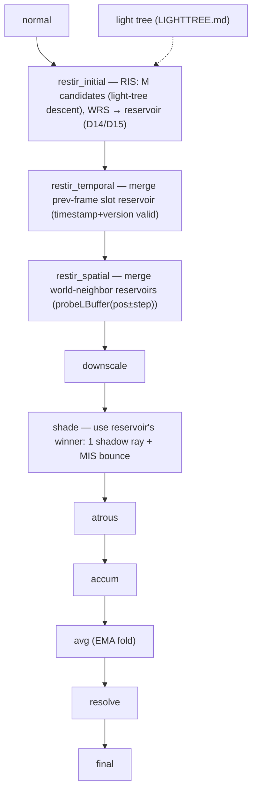

# NEE → RIS → ReSTIR DI/GI — Per-Voxel, In-Slot Reservoirs

> **Status: B2 RIS-NEE + B2.5 (area-face + surface-cull) + B4 MIS + E1 ReSTIR DI all BUILT — temporal
> (E1.0) + spatiotemporal feedback loop (E1.1: per-voxel `restir_spatial` → parallel `resvSp` buffer →
> folded into next temporal; Bitterli-Z, bounded correlation bias). NEXT: E1.2 curvature sampler
> (tangent-plane neighbours fail on spheres), then scene import / E2 GI.** The strict test stays
> exact; structural noise is fixed at the source (**§NEE visibility**). The RIS candidate loop moved
> from `shade` into a per-voxel **`restir.comp`** that also merges the prev-frame reservoir
> (`{y,W,M}` in D14/D15); `shade` reads the reservoir and adds `f·W·w_nee` **evaluated at the light
> centre** (per-pixel shadow ray to the centre). The diffuse bounce is `includeEmission=true`,
> **power-heuristic combined** with the NEE term (§MIS rule). **Centre-consistency is required:** `f`
> and `W`'s target `p̂` must share geometry, else a per-pixel ratio spikes on close lights → fireflies
> that grow with M (fixed). **E1.1 adds world-neighbour spatial reuse** on top of this loop.
> Reservoirs live **in the existing 16-DWORD lBuffer slot** — no second SSBO,
> no slot growth. The lBuffer ([LBUFFER.md](LBUFFER.md)) *is* a world-space hash grid, so
> per-voxel reservoirs are the architecturally-correct choice over screen-space ReSTIR.
> Lights are sampled by descending the [LIGHTTREE.md](LIGHTTREE.md) SVO (no flat table).

## The one path at three maturity levels

NEE, RIS, and ReSTIR DI are the **same code** at increasing `M` and reuse:

| Stage | Adds | Shadow rays |
|---|---|---|
| **B2 · RIS-NEE** | `M` candidate lights (light-tree descent), WRS to 1 winner | 1 |
| **B2.5 · cleanup** | + area-face connection point (real `cosLight`) + surface-culled candidate set | 1 |
| **B4 · MIS** | + power-heuristic combine with the BSDF/bounce technique (re-enables bounce emission) | 1 |
| **E1 · ReSTIR DI** | + temporal reuse (prev-frame slot reservoir) + spatial reuse (world-neighbor probes) | 1 |
| **E2 · ReSTIR GI** | + directional indirect reservoir (diffuse + wide-glossy) replacing the cosine-bounce + flat feedback | 1–2 |

RIS already gives many-light importance sampling at **one** shadow ray (the resampled
winner); the `M` candidate evaluations are *unshadowed* and cheap. So "many lights" does
not multiply ray cost. The M-candidate WRS loop is built (B2); B2.5/B4 clean and combine it;
E1 then just "carries the reservoir across frames/neighbors instead of discarding it."

## NEE visibility — keep the test exact, fix the sampler (B2.5)

The shadow ray decides whether the resampled light voxel `y` is visible. **The estimator is
unbiased only with the *strict* test** `hit.position == y` (the first solid hit IS the sampled
voxel). Every looser test buys lower variance with bias — recorded so they are not retried:

| Visibility test | Patterns? | Bias |
|---|---|---|
| **strict** `hit.position == y` *(kept)* | yes, at grazing | **none — unbiased** |
| any-emissive (`hit is emissive`) | gone | **over-bright** — counts occluded interior voxels of solid clusters |
| distance-tolerance (`tHit ≥ tY − tol·size`) | gone | **scene-dependent**, merely *parameterised* by a knob — not removed |

So the strict test stays (§1D — no tuning for correctness). Its two costs are **variance** and an
**approximation artifact**, never bias — and B2.5 attacks each **at the sampler**, leaving
visibility exact:

1. **Variance on SOLID clusters** → **surface-cull the light tree** (B2.5,
   [LIGHTTREE.md](LIGHTTREE.md) §Surface-cull). Interior voxels of a solid emissive blob are
   genuinely occluded from *every* direction → physically contribute zero → the **enclosed-voxel
   cull** (all 6 face-neighbours solid) removes them from the candidate set entirely, exactly and
   view-independently. *This corrects the earlier "surface-culling rejected" note:* only the
   *toward-camera* cull was wrong; the enclosed cull is view-independent and is now adopted.
   Residual surface-candidate variance (many lights, penumbrae) → phase-2 descent importance
   ([LIGHTTREE.md](LIGHTTREE.md) bounds/cone) + ReSTIR DI reuse (E1).
2. **Patterns on FLAT emitters at grazing** → **area-face sampling** (B2.5). A light voxel
   approximated as a point at its centre makes a grazing ray clip the neighbouring voxel and report
   occluded → a thin plate lights mostly the patch beneath it. Fix: connect to a **uniform random
   point on the voxel's receiver-facing face** (not the centre), with that face's real normal.
   Different samples test different points → the structured pattern averages to unbiased noise, and
   the face normal yields the **`cosLight`** the centre-point integrand omits — the same term B4
   MIS needs for its NEE→solid-angle pdf conversion (which is why area-face lands before MIS).
   Start with the **dominant** receiver-facing face (§1E). **As built:** each candidate area-samples
   its *own* face point and its `p̂` is evaluated there (exactly unbiased — RIS requires `p̂` at the
   actual sample), and the winner's shadow ray aims at that stored point. (The point sampling is a few
   flops; the cost is the descent + the one shadow ray, unchanged.)

**Open refinement:** is dominant-face area sampling enough, or does a projected-area-weighted
3-face (or full per-voxel solid-angle) light model retire the last of the grazing artifact?
Upgrade only if the residual shows.

## ReSTIR PT is rejected

PT (GRIS path resampling) needs a unified **path** reservoir + shift mappings
(reconnection/random-replay Jacobians). That contradicts this engine's committed split —
a **diffuse irradiance cache** + a **separate short-window specular EMA**
([PIPELINE.md](PIPELINE.md), [LBUFFER.md](LBUFFER.md)). PT's value (complex multi-bounce
specular, caustics) is exactly what this renderer approximates away. Adopting PT means
re-founding the renderer, so it is off the table.

## The MIS rule (the double-count trap — state it exactly)

Once NEE samples emissive voxels, `traceRadiance` must **split its return**:

- **Direct-emission term** (a BSDF/bounce ray happens to land on a light): apply the
  **BSDF-side MIS weight** (power heuristic vs the NEE pdf for that light).
- **Cached-diffuse feedback term** (reflected indirect = a neighbor voxel's `E` channel):
  **no MIS weight.** NEE estimates *direct* light only, so the indirect term is not
  double-counted; and the neighbor's cached `E` *already includes its own direct lighting*
  — which is the correct one-bounce indirect.

MIS-weighting (or dropping) the *whole* return is the classic "GI too bright/dark" bug.
Weight **only** the direct-emission term.

**The second trap — partition-of-unity (as built).** The power heuristic is unbiased only if
`w_nee + w_bsdf = 1` at every point, which holds *only* when `p_nee` and `p_bsdf` are the **same
functions** wherever evaluated. `shade.comp` therefore uses **one canonical** `lightSolidAnglePdf`
(`pdfDisc·d²/(A·cosLight)`, voxel **centre + dominant face**) for the NEE-winner weight **and** the
BSDF-hit weight; `p_bsdf = cosθ/π` likewise in both. Computing `p_nee` two different ways (e.g. the
stochastic sampled point for NEE but the centre for the BSDF hit) breaks the partition → a
systematic ~10–30 % error concentrated on **close, intense, off-axis lights** — the very pixels the
B2.5 dominant-face artifact lives in. The MIS weight does not need to be *accurate*, only
*consistent*; the centre-based form is exactly unbiased and the stochastic face point still drives
the shadow ray + RIS contribution. The BSDF reverse pdf comes from `lightTreePdf` ([LIGHTTREE.md](LIGHTTREE.md)
descent, reversed); `lightTreePdf == 0` → `w_bsdf = 1`.

## DI feeds the EMA — it does not replace it (overrides old ROADMAP E)

The temporal EMA ([LBUFFER.md](LBUFFER.md)) and a ReSTIR reservoir reduce variance on
**different axes**: the reservoir accumulates good *candidates* (which light/sample
matters), the EMA accumulates the converged *result* over hundreds of frames. ReSTIR DI
therefore emits a clean, low-variance **1-spp direct term** that folds into the existing
`E/π` diffuse channel; the EMA keeps converging. (You may shorten `emaDiffuse` once DI
lands — the per-frame estimate is already lower variance. Tuning, not redesign.) The old
ROADMAP note "reservoir merge *replaces* the EMA" is wrong and is corrected here.

## In-slot reservoirs — "reference, not payload"

A parallel reservoir SSBO would **add** VRAM (the lBuffer is already the memory pressure)
and split storage of one concept across two buffers (harder to read). Both are avoided:
reservoirs fit the existing slot because the world is voxels and **the sample's payload
already lives in the sample voxel's own slot**.

Freed space (see [LBUFFER.md](LBUFFER.md)): **D14 and D15 are both free — settled.** Diffuse
staleness (B3) is handled **in-register** by extending the `specStaleFrames` sample-count reset to
the diffuse channel under one shared window, needing **no** per-slot stamp. The earlier slot-budget
contention ("D14 contended — resolve before E1") is therefore **resolved**: DI takes D14+D15
outright. **GI** needs ~1 more DWORD, reclaimed by **oct-encoding D3** (normal → 2×10-bit) and
**tightening D6** (sample counts) — a packing change, no new buffer. The **accumulator-move** (D7–D13
to a parallel buffer) and **chroma-RG** ideas were considered and **shelved** (§1E): indexed by slot
the move saves nothing, indexed by visible-count it adds a back-reference + overflow handling for a
VRAM win not yet needed; chroma-RG trades HDR colour fidelity for bits RGB9E5 already packs tightly.

**DI reservoir — 2 DWORDs (D14 + D15):** persist only `{ y, W, M }` (Bitterli 2020):
- `y` = chosen light reference (light-tree leaf / emissive voxel id): ≤24 bits
- `M` = confidence count, capped (~32): ≤8 bits → **`y | M` packed in D14**
- `W` = unbiased contribution weight, one fp32 → **D15**
- `p_hat(y)` is **recomputed** at reuse (re-evaluate light `y`'s unshadowed contribution to
  this voxel) — never stored.

**GI reservoir — ~3 DWORDs (D14 + D15 + 1 reclaimed), reference-based:**
- sample = the bounce-hit voxel → store its **lBuffer key** (≈2 DWORDs)
- its **radiance** = `probeLBuffer(sample).diffuse` — already cached in *that* slot
- its **normal** = `probeLBuffer(sample).D3` — already there
- the reconnection-shift **Jacobian** (distances/cosines) is computed from the two voxel
  centers — both known, nothing stored
- `W` (fp32) + `M` (packed into the key's spare bits)
- the sample **direction** is implicit: `dir = normalize(sampleCenter − thisCenter)`

Quantizing the GI sample to voxel granularity is **exact**, not an approximation — the
world is voxels.

## World-space reuse, not screen-space

- **Temporal reuse:** the slot persists across frames; validity is the timestamp (`D2`)
  and the `version` key component (a re-incarnated voxel gets a new key → stale reservoir
  is not reused). No history buffer.
- **Spatial reuse:** probe **world-neighbor voxels** — `probeLBuffer(pos ± voxelStep)`
  (3–6 gathers) — **not** slot `s±1` (the hash scatters neighbors arbitrarily). This is
  the "spatial filtering" the roadmap wanted; it removes residual inter-voxel noise more
  principledly than a post-hoc cache blur or a smoother resolve read (both dropped).

## Glossy / mirrors — keep specular off the reservoir

ReSTIR GI handles **diffuse + wide-glossy only**, gated by roughness. A near-mirror lobe
is so tight that temporal/spatial neighbor samples are almost all invalid → reuse is
either rejected (no benefit) or blurs the reflection (harm). So:

- **Low-roughness / mirror specular stays on the current direct GGX-VNDF trace path** (the
  specular channel + short EMA). Mirrors are preserved exactly as today.
- As roughness rises the lobe widens, neighbor samples become valid, and GI reservoir
  reuse begins to pay off.

This needs **no hybrid per-pixel system**: sharp specular is still *per-voxel traced*
(today's path), just **not resampled**. The short-window specular EMA (`specStaleFrames`)
is already a *view-dependent per-voxel* radiance cache; the GI reservoir extends the same
idea for indirect — it stores a directional **reference**, and `resolve` evaluates
`BRDF(view, dir_to_sample)` per pixel, so view-dependence emerges at resolve without any
per-pixel storage. The hard ceiling: a voxel covering many pixels cannot hold a sharp
view-dependent lobe — but at depth 9 voxels ≈ pixels, and mirror-sharp reflections stay on
the traced path regardless.

## Pass placement

ReSTIR passes (E1+) dispatch over `uniqueVoxelList` (one thread per visible voxel),
exactly like `normal`/`avg`. B2's RIS-NEE collapses `restir_initial` into `shade` (no
persisted reservoir yet); E1 splits it out and adds temporal/spatial.

**B2.5 and B4 add NO passes.** Area-face sampling and MIS are edits *inside* `shade.comp`;
surface-cull is CPU-side light-tree maintenance on the existing `onLeafChanged` hook
([LIGHTTREE.md](LIGHTTREE.md) §Surface-cull). The pipeline structure ([PIPELINE.md](PIPELINE.md))
is unchanged until E1 introduces the three reservoir passes above.
